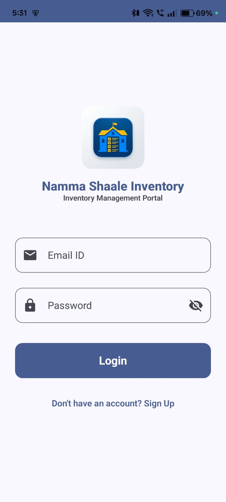
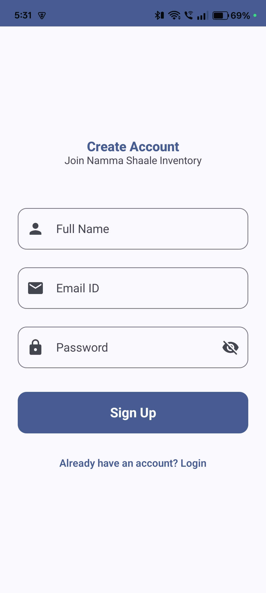
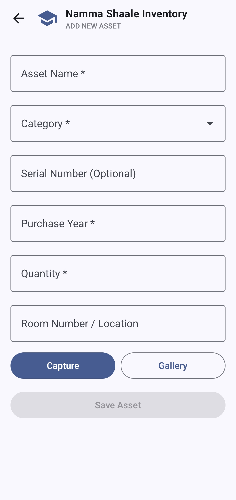
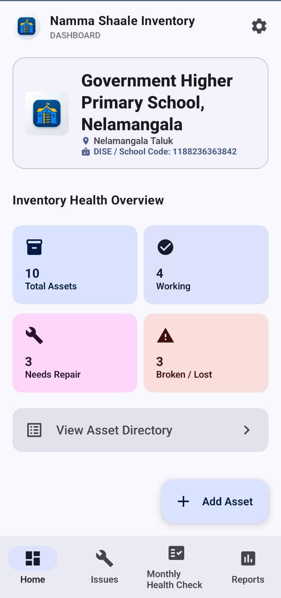
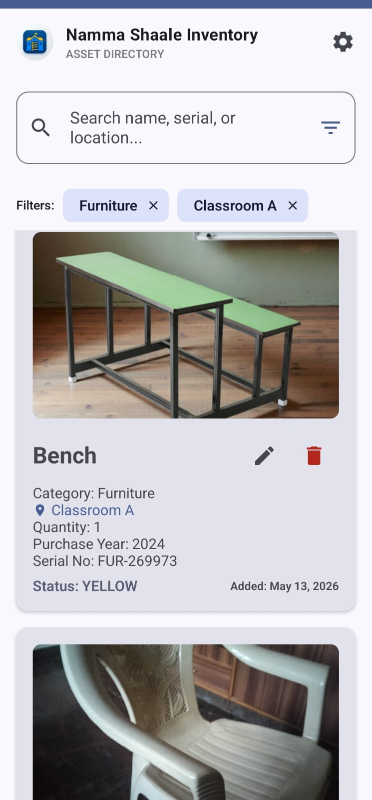
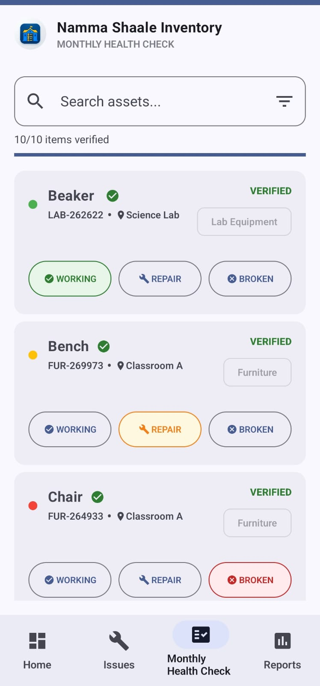
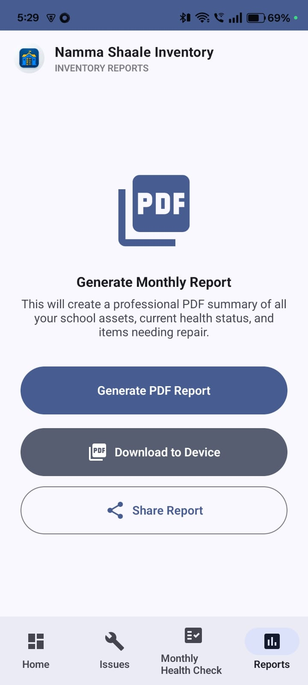
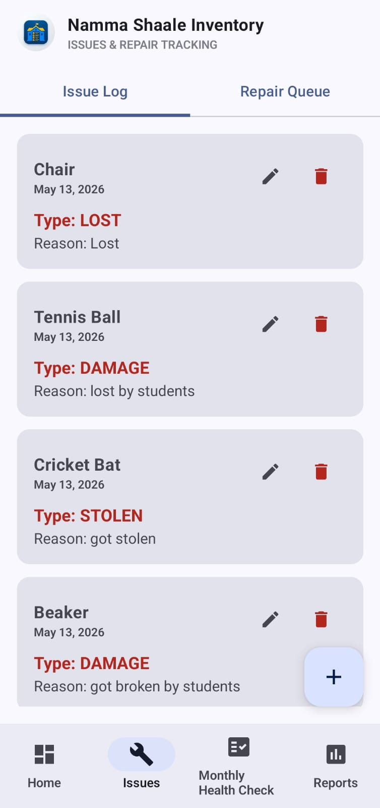
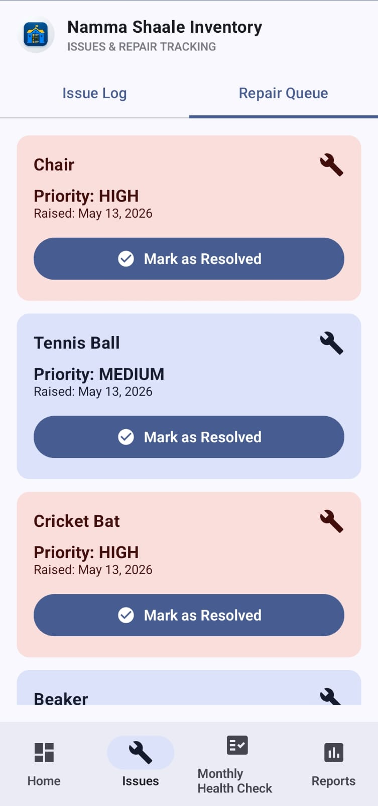

# Namma Shaale Inventory 🏫📦

**Namma Shaale Inventory** is a modern, professional Android application designed to streamline asset management and inventory tracking for government schools. Built with a focus on accessibility and security, the app empowers school staff to maintain high-quality educational environments.

---

## 🌟 Key Features

### 🔐 Secure Cloud Authentication
- **Firebase Integration**: Secure Login and Sign-Up system using Email and Password.
- **Persistent Sessions**: Stay logged in even after closing the app for faster daily access.

### 🌍 Multilingual Support (English & Kannada)
- **Localization**: Full support for **Kannada**, ensuring inclusivity for staff in rural government schools.
- **Dynamic Toggle**: Instantly switch languages from the settings menu.

### 📊 Professional Dashboard
- **Real-time Insights**: View health statistics of school assets (Working, Needs Repair, Broken).
- **School Profile**: Integrated school information including DISE code and address.

### 📄 Inventory Management & Reporting
- **Asset Directory**: Comprehensive list of all school furniture, electronics, and supplies.
- **PDF Generation**: Export professional inventory reports with a single tap for official documentation.
- **Monthly Health Check**: Dedicated workflow for periodic audits of school infrastructure.

---

## 🛠️ Technology Stack

- **Language**: Kotlin
- **UI Framework**: Jetpack Compose (Modern Declarative UI)
- **Architecture**: MVVM (Model-View-ViewModel) + Clean Architecture
- **Database**: Room Database (Offline-first local persistence)
- **Cloud Service**: Firebase Authentication
- **DI Framework**: Hilt (Dependency Injection)
- **Reporting**: PDF Box for Android

---

## 🚀 Getting Started

### Prerequisites
- Android Studio Iguana or newer
- JDK 17
- A Firebase project with `google-services.json` placed in the `app/` directory.

### Installation
1. Clone the repository:
   ```bash
   git clone https://github.com/yourusername/NammaShaaleInventory.git
   ```
2. Open the project in Android Studio.
3. Sync Gradle and run the app on an emulator or physical device.

---

## 📸 Screenshots

<p align="center">
  
  
  
</p>

<p align="center">
  
  
  
</p>

<p align="center">
  
  
  
</p>

---

## 📄 License
This project is licensed under the MIT License - see the LICENSE file for details.

---

**Developed for Namma Shaale Initiative** 🇮🇳
